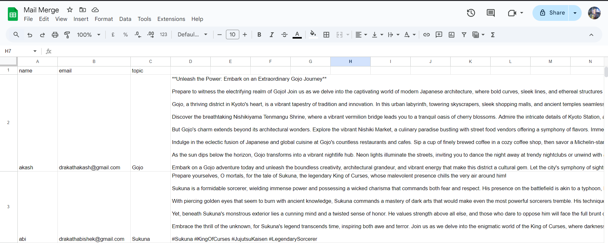
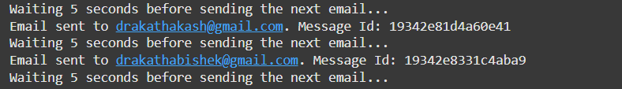
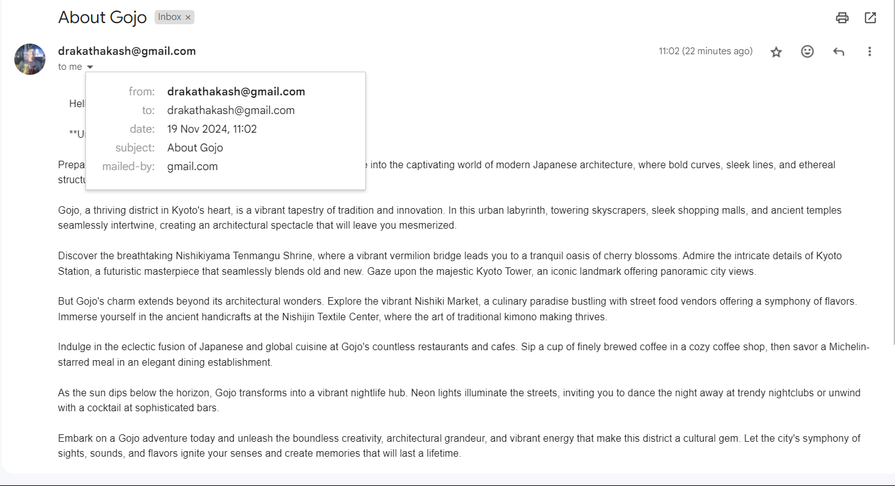

# Automated Email Sender from Google Sheets Using Gmail API

This project allows you to send automated emails using data from a Google Sheet, where each row contains the recipient’s name, email, a topic, and message content. The script uses Gmail API and Google Sheets API, with the option to generate messages dynamically using Gemini (AI language model).

### Features:
1. **Automates sending emails** from a Google Sheet.
2. **Fetches recipient data** from the sheet: name, email, topic, and message.
3. **Generates dynamic email body** based on the topic (optional: using Gemini API).
4. **Throttling**: Prevents hitting Gmail API limits by adding a delay between each email.
5. **Token-based authentication** for Gmail and Google Sheets using `token.pickle` (no need to reauthenticate).

---

## Google Sheet with Generated Text

The first image shows the Google Sheet with the following columns:

1. **Column A**: Recipient's Name
2. **Column B**: Recipient's Email
3. **Column C**: Email Topic
4. **Column D**: Generated Data/Message (generated dynamically from the Gemini API using the **Topic**)

### Google Sheet Example:


The **Topic** column is used to generate the message content in the **Data** column, which is then sent to each recipient as the email body.

---

## Email Sent Using the Script

The second image shows the screenshot of the email sent using the Gmail API, where each email is personalized with the recipient's name and topic.

### Sent Email Screenshot:


---

## Received Email in the Inbox

Finally, the third image shows the email as it appears in the recipient's inbox, demonstrating the successful delivery of the automated email.

### Received Email Screenshot:


---

These images illustrate the complete flow, from generating dynamic content using Gemini to sending personalized emails and confirming their delivery in the recipient's inbox.

---

### Notes:
- Make sure you have the proper Google Sheet structure as described in the **Example Google Sheet Structure** section.
- Ensure that your **Gemini API** (or whichever API you’re using) is set up to generate appropriate messages based on the topic.

---

## Prerequisites

1. **Google Cloud Project**: You need to set up a Google Cloud project and enable the necessary APIs.
2. **Google Sheets**: You must have a Google Sheet with the following structure:
   - **Column A**: Name of the recipient.
   - **Column B**: Recipient's email.
   - **Column C**: Topic for the email.
   - **Column D**: Data or message to be included in the email.

---

## Step 1: Set Up Google Cloud Project and Enable APIs

To interact with Gmail and Google Sheets, you'll need to set up a project on Google Cloud and enable the following APIs:

1. **Google Sheets API**: Allows reading data from a Google Sheet.
2. **Gmail API**: Allows sending emails via Gmail.
3. **Gemini API**: (optional, if you want to generate messages dynamically based on the topic column).

### Steps to Enable APIs in Google Cloud Console:

1. **Create a New Google Cloud Project**:
   - Go to [Google Cloud Console](https://console.cloud.google.com/).
   - Click on `Select Project` at the top, then `New Project`.
   - Name your project and click `Create`.

2. **Enable APIs**:
   - **Google Sheets API**:
     - Go to the [Google Sheets API page](https://console.developers.google.com/apis/library/sheets.googleapis.com).
     - Click on `Enable`.
   - **Gmail API**:
     - Go to the [Gmail API page](https://console.developers.google.com/apis/library/gmail.googleapis.com).
     - Click on `Enable`.
   - **Gemini API** (Optional):
     - If you want to generate messages using Gemini, you'll need to enable the Gemini API (or whichever language model service you're using).
     - Go to the appropriate API page in Google Cloud and enable it.

3. **Create OAuth 2.0 Credentials**:
   - Go to the [Credentials page](https://console.cloud.google.com/apis/credentials).
   - Click `Create Credentials` > `OAuth 2.0 Client IDs`.
   - Choose **Desktop App** as the application type.
   - Download the `credentials.json` file when prompted. This will be needed for the initial authentication.

4. **Download the `token.pickle` File**:
   - Once the credentials are created and the APIs are enabled, you will need to authenticate using the `credentials.json` to generate a `token.pickle` file.
   - The script will guide you through this process (the token is used for API access and avoids needing repeated logins).

---

## Step 2: Install Required Dependencies

Before running the script, make sure you have the following dependencies installed:

```bash
pip install --upgrade google-api-python-client google-auth-httplib2 google-auth-oauthlib gspread oauth2client google-colab google-auth
```

## Step 3: Get Token.pickle

Before working on the script make sure to generate the below python code on your local machine to generate a runnable server for authentication to work

```python
pip install --upgrade google-api-python-client google-auth-httplib2 google-auth-oauthlib gspread oauth2client google-colab google-auth

from google_auth_oauthlib.flow import InstalledAppFlow
import os
import pickle

# Set the scope you need, e.g., for Gmail and Sheets
SCOPES = [
    'https://www.googleapis.com/auth/gmail.send',
    'https://www.googleapis.com/auth/spreadsheets',
    'https://www.googleapis.com/auth/drive'
]

# Load your credentials.json file
flow = InstalledAppFlow.from_client_secrets_file(r'C:\Users\draka\Downloads\credentials.json', SCOPES)
creds = flow.run_local_server(port=0)  # This will open a local browser for authentication

# Save the credentials as a token.pickle file
with open('token.pickle', 'wb') as token:
    pickle.dump(creds, token)

print("Token created and saved as token.pickle")

```

## Step 4 : Generate your Gemini API key

For the generation part of project to work, I have chosen to use the free Gemini API. It passes on the topic and writes down the required message.
You will be asked for your API key while running the script in collab.

## Step 5: Run the collab script

Multiple variables can be changed according to user such as: 
- gemini generation prompt
- body of the email script
- delay for throttling


